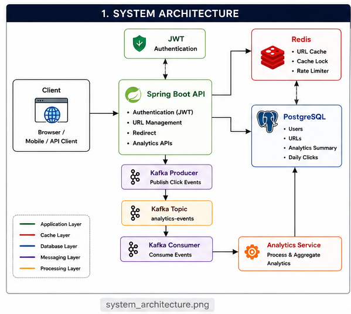
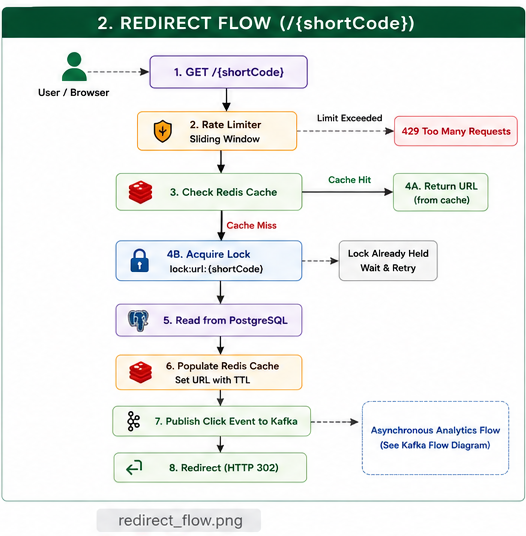
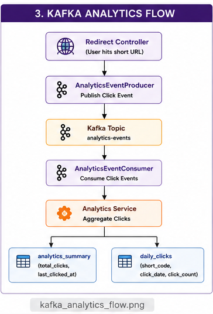
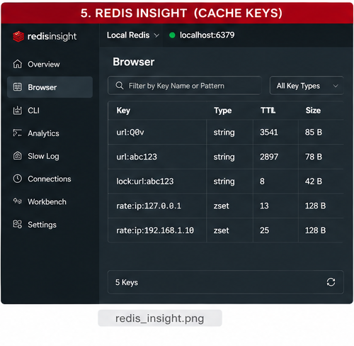
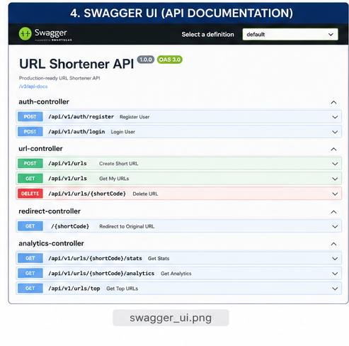
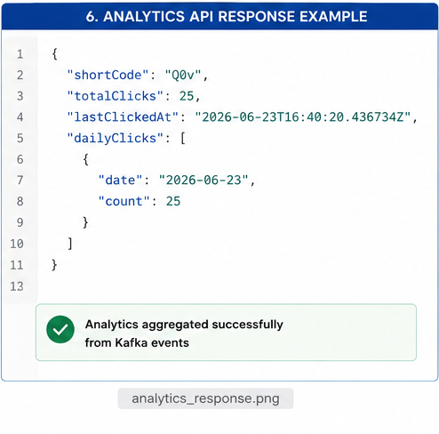

# 🚀 URL Shortener — Production-Style Backend System

A production-style URL Shortener built using **Java 17, Spring Boot 3, PostgreSQL, Redis, Kafka, Flyway, Docker and JWT Authentication**.


This project goes beyond basic CRUD operations by demonstrating backend engineering concepts commonly used in scalable distributed systems, including Redis caching, Kafka-based asynchronous messaging, rate limiting, JWT authentication, and analytics aggregation.


---

# ✨ Features

## 🏗️ System Architecture


## 🔄 Redirect Flow


## ⚡ Kafka Analytics Flow


## 🗄️ Redis Cache


## 📚 API Documentation


### Sample Analytics Response



## Authentication

* JWT Authentication
* User Registration
* User Login
* Protected APIs
* BCrypt Password Encryption

---

## URL Management

* Create Short URLs
* Custom Alias Support
* Expiration Support
* Soft Delete
* User-owned URLs
* Base62 Encoding

---

## Performance

* Redis Cache
* Cache-Aside Pattern
* Cache Stampede Protection
* Sliding Window Rate Limiter

---

## Analytics

* Kafka Event Publishing
* Asynchronous Analytics Processing
* Total Click Tracking
* Daily Click Aggregation
* Top URLs API

---


# 📦 Tech Stack

| Category         | Technology                       |
| ---------------- | -------------------------------- |
| Language         | Java 17                          |
| Framework        | Spring Boot 3                    |
| Security         | Spring Security + JWT            |
| ORM              | Spring Data JPA                  |
| Database         | PostgreSQL                       |
| Cache            | Redis                            |
| Messaging        | Apache Kafka                     |
| Migration        | Flyway                           |
| Build Tool       | Maven                            |
| Testing          | JUnit 5, Mockito, Testcontainers |
| Containerization | Docker, Docker Compose           |

---

# 📊 Database Schema

### users

Stores registered users.

### urls

Stores:

* Original URL
* Short Code
* Owner
* Expiry
* Soft Delete

### analytics_summary

Stores:

* Total Clicks
* Last Click Timestamp

### daily_clicks

Stores aggregated click counts per day.

---

# ⚡ Redis Keys

| Key                    | Purpose                     |
| ---------------------- | --------------------------- |
| `url:{shortCode}`      | URL Cache                   |
| `lock:url:{shortCode}` | Cache Stampede Lock         |
| `rate:ip:{ip}`         | Sliding Window Rate Limiter |

---

# 📡 Kafka Flow

Every successful redirect publishes a lightweight event.

Producer:

```
RedirectController
        │
        ▼
AnalyticsEventProducer
        │
        ▼
analytics-events
```

Consumer:

```
analytics-events
        │
        ▼
AnalyticsEventConsumer
        │
        ▼
AnalyticsService
        │
        ▼
analytics_summary
daily_clicks
```

This ensures redirect latency remains low while analytics are processed asynchronously.

---

# 🔐 Security

* JWT Authentication
* Stateless Sessions
* BCrypt Password Hashing
* Protected REST APIs
* Public Redirect Endpoint

---

# 🧪 Testing

The project includes:

* Unit Tests
* Service Layer Tests
* Repository Integration Tests

---

# 🚀 Running the Project

```bash
docker compose up -d

mvn clean install

mvn spring-boot:run
```

---

# 📚 API Endpoints

### Authentication

```
POST /api/v1/auth/register
POST /api/v1/auth/login
```

### URL Management

```
POST /api/v1/urls
GET /api/v1/urls
DELETE /api/v1/urls/{shortCode}
```

### Redirect

```
GET /{shortCode}
```

### Analytics

```
GET /api/v1/urls/{shortCode}/stats
GET /api/v1/urls/{shortCode}/analytics
GET /api/v1/urls/top
```

---

# 💡 Backend Concepts Demonstrated

* JWT Authentication
* Cache-Aside Pattern
* Cache Stampede Prevention
* Sliding Window Rate Limiting
* Event-Driven Architecture
* Asynchronous Processing
* Repository Pattern
* Service Layer Architecture
* Soft Deletes
* Dockerized Local Development

---

# 🔮 Future Enhancements

* Geo-location Analytics
* QR Code Generation
* Custom Domains
* Redis Cluster
* Kafka Multi-Broker Deployment
* Prometheus & Grafana Monitoring

---

# 📄 License

This project is intended for learning, portfolio demonstration, and backend engineering interview preparation.
